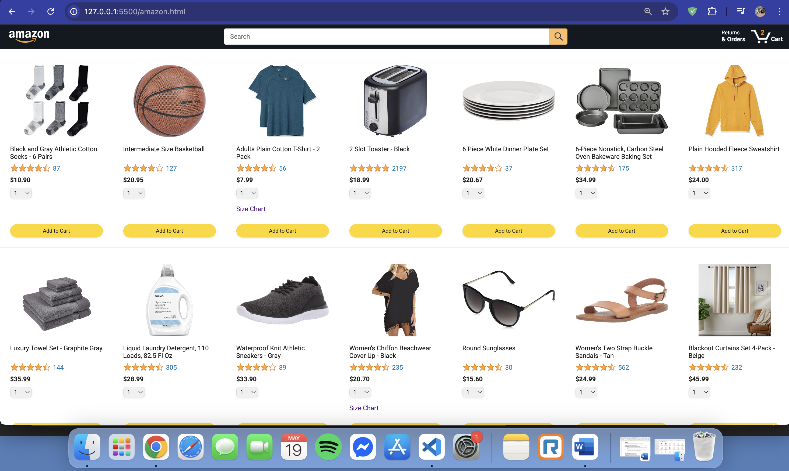
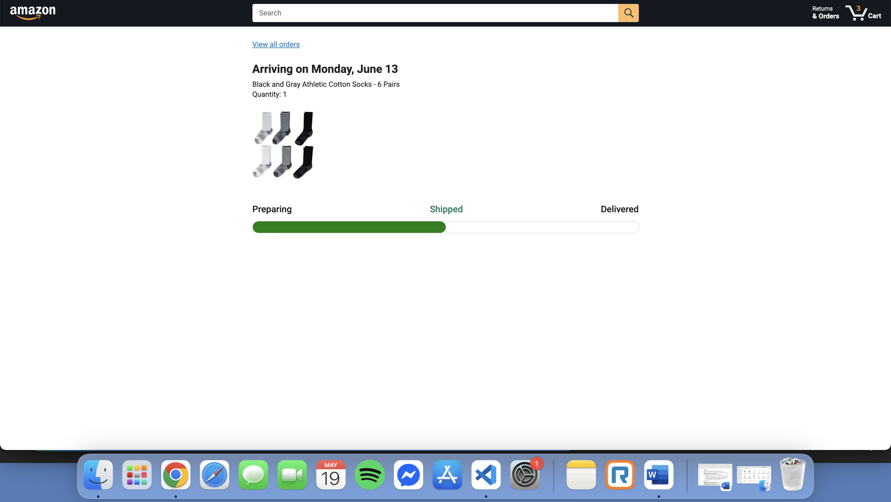

# 🛒 Amazon Clone – E-Commerce Frontend

A fully functional and responsive Amazon-style e-commerce site built using HTML, CSS, and JavaScript. Developed as part of the SuperSimpleDev course to practice real-world frontend development concepts.

🔗 [Live Demo on GitHub Pages](https://saugat2060.github.io/Amazon_Clone/)

---

## 📸 Screenshots

### 🏠 Homepage


### 🛒 Checkout Page


### 📦 Orders


### 🚚 Delivery Tracking


---

## ✨ Features

- Dynamic product listing with API integration
- Add to Cart with quantity selection
- Checkout with delivery options
- Real-time cart update in header
- Order history and delivery status UI
- Mobile responsive layout
- Modular JavaScript and reusable components

---

## 🛠 Tech Stack

- HTML5
- CSS3 (Flexbox, Grid)
- JavaScript (ES6 Modules)
- Git & GitHub
- GitHub Pages
- VS Code

---

## 🎓 What I Learned

- DOM manipulation with `querySelector`, `addEventListener`, etc.
- Working with JSON data and remote APIs (`fetch`, `XMLHttpRequest`)
- Using OOP in JavaScript to structure products as classes
- Building multi-page apps with localStorage to persist data
- Responsive design techniques using media queries
- Creating clean, animated UI components with CSS
- Fixing path issues for GitHub Pages deployment
- Git commands: `init`, `add`, `commit`, `push`, `pull`, `rebase`
- Project organization, file naming conventions, and modularity
- Debugging common frontend issues (404s, JS errors)

---

## 📂 Folder Structure

Amazon_Clone/
├── amazon.html
├── checkout.html
├── orders.html
├── track.html
├── scripts/
│ ├── amazon.js
│ ├── checkout.js
│ └── data/
├── styles/
│ ├── shared/
│ └── pages/
├── images/
│ └── screenshots/
└── README.md

yaml
Copy
Edit

---

## 🧪 How to Run Locally

1. Clone the repo:
   ```bash
   git clone https://github.com/SAUGAT2060/Amazon_Clone.git
Open the project folder.

Launch amazon.html using Live Server or open it in your browser.

🙏 Credits
Inspired by the SuperSimpleDev Amazon Project

Built and enhanced by Saugat Rana

👨‍💻 Author
Saugat Rana
📍 Toronto, ON
🔗 LinkedIn
🐙 GitHub